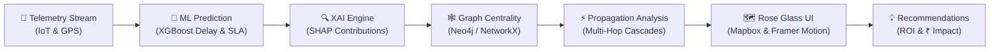

# MeetMux Control Tower — Architecture Design Document

**Subtitle**: Predictive Supply-Chain Intelligence — from Telemetry to Decision  
**Company**: MeetMux Logistics & Fulfilment Network  
**Geography**: India (Mumbai, Delhi NCR, Bengaluru, Chennai, Kolkata, Ahmedabad, Jaipur, Pune, Hyderabad)  
**Currency**: INR ₹  

---

## 1. High-Level Architecture Overview

MeetMux Control Tower is an enterprise-grade decision intelligence platform that transforms raw operational telemetry into proactive business decisions. Unlike static reporting dashboards, the platform implements a closed-loop decision cycle:



---

## 2. Technology Stack

| Layer | Technologies |
|---|---|
| **Frontend** | React 18, TypeScript, Vite, Tailwind CSS, Framer Motion, Mapbox GL JS, Recharts, TanStack React Query, Axios, Zustand, Lucide Icons |
| **Backend** | Python 3.13, FastAPI, Pydantic v2, Uvicorn, WebSockets |
| **Machine Learning** | XGBoost 2.0 (XGBClassifier & XGBRegressor), scikit-learn, SHAP TreeExplainer, Pandas, NumPy |
| **Graph Intelligence** | Neo4j 5.x / Cypher with in-memory NetworkX 3.x automatic fallback |
| **Telemetry** | Asynchronous WebSockets stream (`/ws/telemetry`) broadcasting live position, speed, and congestion |

---

## 3. Frontend Architecture

### 3.1 Design System — “Rose Glass”
- **Background**: Soft blush gradient (`#FFF5F8` → `#FDE8EF` → `#FBD5E2`) with subtle SVG noise mesh.
- **Glassmorphism**: Translucent panels (`rgba(255, 255, 255, 0.50)`), 18px backdrop blur, 1px white border, soft rose drop shadows (`0 8px 32px rgba(214, 88, 138, 0.15)`).
- **Harmonized Risk Palette**:
  - `LOW`: Sage / Forest Green (`#2E7D32` on `#E8F5E9`)
  - `MEDIUM`: Warm Amber (`#D97706` on `#FEF3C7`)
  - `HIGH`: Coral Orange (`#EA580C` on `#FFEDD5`)
  - `CRITICAL`: Crimson Red (`#DC2626` on `#FEE2E2` with pulsing ring)

### 3.2 Animation Subsystem (`src/motion/variants.ts`)
- Reusable springs (`gentle`, `snappy`, `bouncy`)
- Page transitions with `AnimatePresence` (fade + spring slide)
- Staggered entrances for cards, tables, and lists
- Animated counter hook (`useAnimatedCounter`) for KPI metrics
- Ripple propagation overlays for cascading failure visualization
- Slide-in glass drawers for entity inspection

---

## 4. Backend Service Architecture

```
backend/
├── app/
│   ├── api/          # Route declarations
│   ├── graph/        # GraphEngine (Neo4j + NetworkX fallback)
│   ├── schemas/      # Pydantic v2 request/response validation
│   ├── services/     # Domain services:
│   │   ├── bottleneck_service.py
│   │   ├── propagation_service.py
│   │   ├── simulation_service.py
│   │   ├── recommendation_service.py
│   │   ├── copilot_service.py
│   │   ├── alert_service.py
│   │   └── analytics_service.py
│   └── streaming/    # Telemetry WebSocket broadcaster
└── main.py           # FastAPI entrypoint, CORS & error handling
```

---

## 5. Decision Loop Walkthrough

1. **Telemetry Ingestion**: Ingests vehicle GPS, velocity, temperature, humidity, stop counts, and hub load.
2. **Predictive Inference**: Model evaluates delay probability $P(\text{delay})$ and predicted delay duration.
3. **Explainability (SHAP)**: Identifies top positive and negative drivers contributing to the risk score.
4. **Graph Bottleneck Detection**: Calculates degree centrality, betweenness centrality, and facility utilization.
5. **Multi-Hop Propagation**: Traverses downstream paths to pinpoint second- and third-tier ripple effects.
6. **Quantified Business Impact**: Translates delay hours and SLA breaches into concrete INR ₹ exposures and actionable ROI-backed mitigations.
