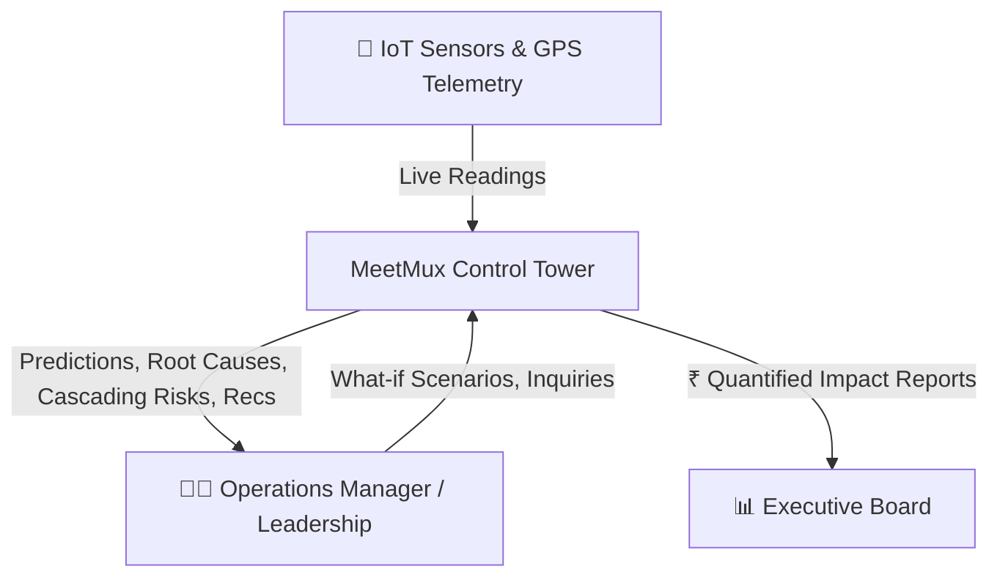
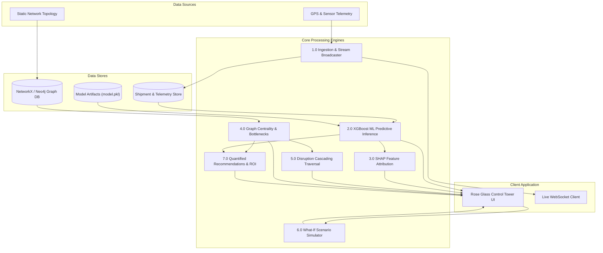
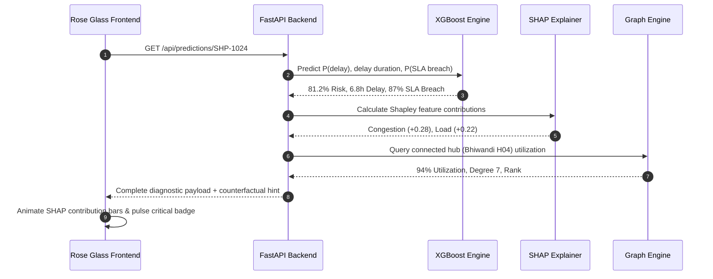

# MeetMux Control Tower — Data Flow Diagrams (DFD)

## Level 0: Context Diagram

```mermaid
flowchart TD
    IoT["📡 IoT Sensors & GPS Telemetry"] -->|Live Readings| Platform["MeetMux Control Tower"]
    Ops["👨‍💼 Operations Manager / Leadership"] -->|What-if Scenarios, Inquiries| Platform
    Platform -->|Predictions, Root Causes, Cascading Risks, Recs| Ops
    Platform -->|₹ Quantified Impact Reports| Exec["📊 Executive Board"]
```

---

## Level 1: System Decomposition

```mermaid
flowchart TD
    subgraph Data Sources
        T["GPS & Sensor Telemetry"]
        G["Static Network Topology"]
    end

    subgraph Core Processing Engines
        P1["1.0 Ingestion & Stream Broadcaster"]
        P2["2.0 XGBoost ML Predictive Inference"]
        P3["3.0 SHAP Feature Attribution"]
        P4["4.0 Graph Centrality & Bottlenecks"]
        P5["5.0 Disruption Cascading Traversal"]
        P6["6.0 What-If Scenario Simulator"]
        P7["7.0 Quantified Recommendations & ROI"]
    end

    subgraph Data Stores
        D1[("Shipment & Telemetry Store")]
        D2[("NetworkX / Neo4j Graph DB")]
        D3[("Model Artifacts (model.pkl)")]
    end

    subgraph Client Application
        UI["Rose Glass Control Tower UI"]
        WS["Live WebSocket Client"]
    end

    T --> P1
    P1 --> D1
    P1 --> WS
    G --> D2

    D1 --> P2
    D3 --> P2
    P2 --> P3
    P2 --> UI
    P3 --> UI

    D2 --> P4
    P4 --> P5
    P5 --> UI
    P4 --> UI

    UI --> P6
    P6 --> UI

    P4 --> P7
    P2 --> P7
    P7 --> UI
```

---

## Level 2: Predictive Risk & Explainability Loop

```mermaid
sequenceDiagram
    autonumber
    participant UI as Rose Glass Frontend
    participant API as FastAPI Backend
    participant ML as XGBoost Engine
    participant SHAP as SHAP Explainer
    participant Graph as Graph Engine

    UI->>API: GET /api/predictions/SHP-1024
    API->>ML: Predict P(delay), delay duration, P(SLA breach)
    ML-->>API: 81.2% Risk, 6.8h Delay, 87% SLA Breach
    API->>SHAP: Calculate Shapley feature contributions
    SHAP-->>API: Congestion (+0.28), Load (+0.22)
    API->>Graph: Query connected hub (Bhiwandi H04) utilization
    Graph-->>API: 94% Utilization, Degree 7, Rank #1
    API-->>UI: Complete diagnostic payload + counterfactual hint
    UI->>UI: Animate SHAP contribution bars & pulse critical badge
```
