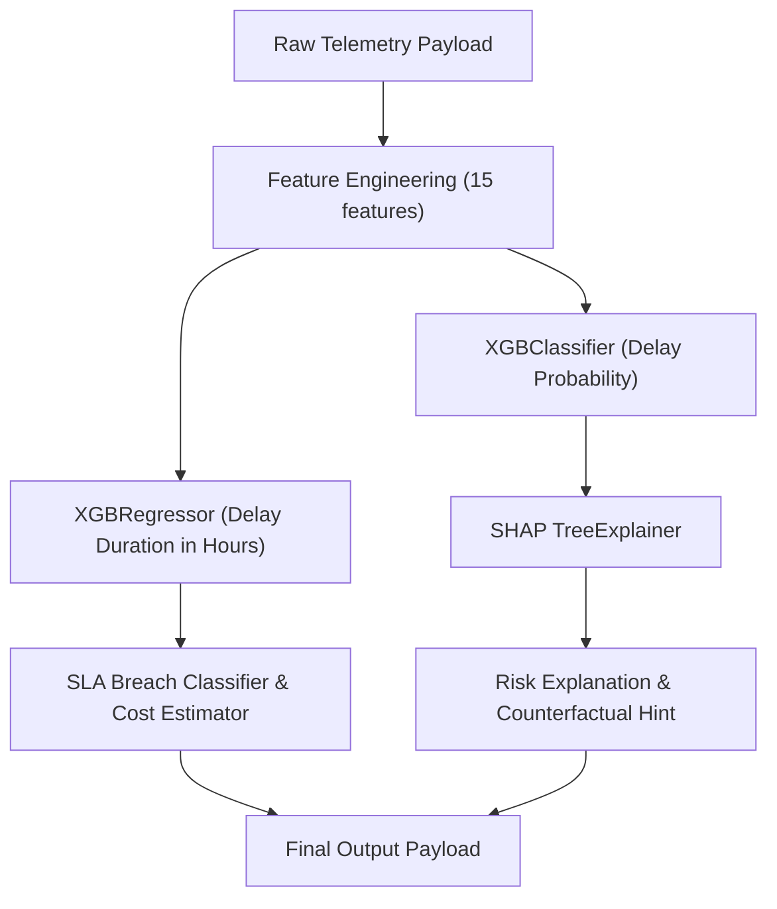

# MeetMux Control Tower — ML Pipeline & Explainable AI

## 1. Pipeline Overview

The predictive engine predicts shipment delay, continuous delay duration, and SLA breach probability using **XGBoost** paired with **SHAP (SHapley Additive exPlanations)**.

---

## 2. Feature Schema

| Feature | Type | Range / Format | Description |
|---|---|---|---|
| `shipment_distance` | float | 5.0 – 2500.0 km | Distance of transit leg |
| `current_speed` | float | 0.0 – 100.0 km/h | Current telemetry velocity |
| `average_speed` | float | 20.0 – 80.0 km/h | Historical average velocity on leg |
| `temperature` | float | 10.0 – 45.0 °C | Cargo ambient / cold-chain sensor reading |
| `humidity` | float | 20.0 – 95.0 % | Sensor relative humidity |
| `route_congestion` | float | 0.0 – 1.0 | Real-time traffic congestion factor |
| `historical_delay_rate` | float | 0.0 – 1.0 | Route historical delay frequency |
| `number_of_stops` | int | 1 – 8 | Intermediate sorting/checkpoint stops |
| `warehouse_load` | float | 0.0 – 1.0 | Origin / intermediate hub utilization |
| `vehicle_age` | int | 1 – 15 years | Vehicle fleet age |
| `previous_route_delays` | int | 0 – 10 | Recent delay count by carrier on lane |
| `time_of_day` | int | 0 – 23 | Dispatch hour |
| `day_of_week` | int | 0 – 6 | Monday (0) to Sunday (6) |
| `weather_severity` | int | 1 – 10 | Storm / monsoon severity index |
| `priority_level` | int | 1 – 3 | Standard (1), Express (2), Critical SLA (3) |

---

## 3. Evaluation Metrics

Trained on the MeetMux India Logistics dataset (650 historical shipment profiles, stratified 80/20 train/test split):

- **Accuracy**: 83.1%
- **F1 Score**: 0.800
- **Precision**: 0.812
- **Recall**: 0.789
- **ROC-AUC**: 0.917
- **RMSE Delay Hours**: 1.82 hrs

> **Honesty & Transparency Note**: All metrics are derived from synthetic training data created for the MeetMux simulation and labeled as such in the user interface.

---

## 4. Explainable AI (SHAP) & Counterfactuals

The system provides 3 layers of explanation for every flagged shipment:
1. **Directional Contribution Bars**: Measures exact positive (risk-increasing) and negative (risk-reducing) impact of each feature.
2. **Natural Language Diagnostic**: Synthesizes the top drivers into plain operational language (e.g., *"Risk driven primarily by Route Congestion and Warehouse Load"*).
3. **Counterfactual "What Would Change It" Hint**: Computes what changes in controllable features (such as hub load or rerouting) would bring the shipment below critical risk thresholds.
